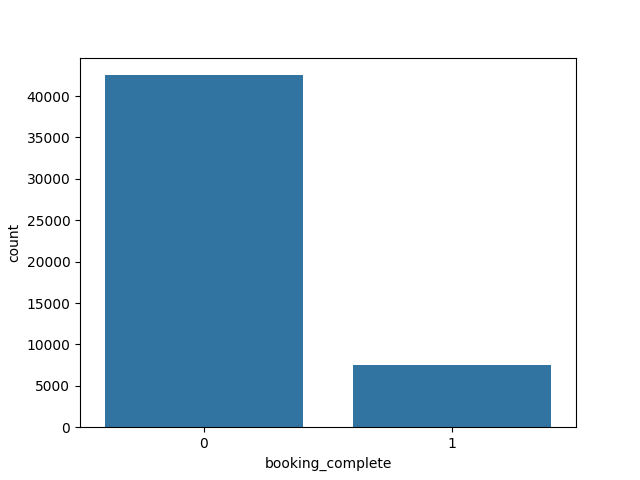

# ✈️ British Airways Customer Behavior Prediction
Machine Learning project to predict customer booking behavior using British Airways dataset

## 📌 Project Overview
Machine Learning project to predict customer booking behavior using British Airways dataset.

## 🎯 Problem Statement
Understand factors influencing booking decisions.

## 🧠 Approach
- Data Cleaning
- EDA
- Feature Engineering
- Logistic Regression Model
- Evaluation

## 📊 Visualizations

## 🛠 Tools
Python, Pandas, NumPy, Seaborn, Matplotlib, Scikit-learn

## 📌 Author
Neha Gangawane
